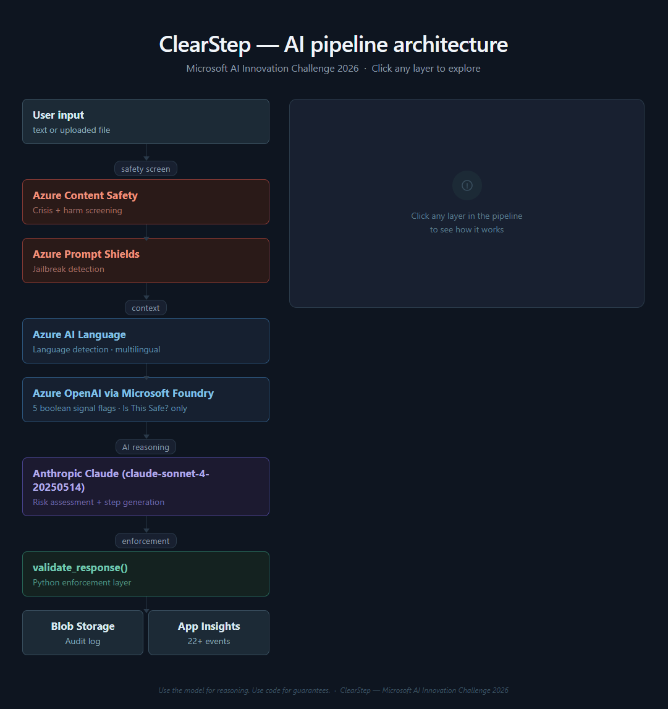
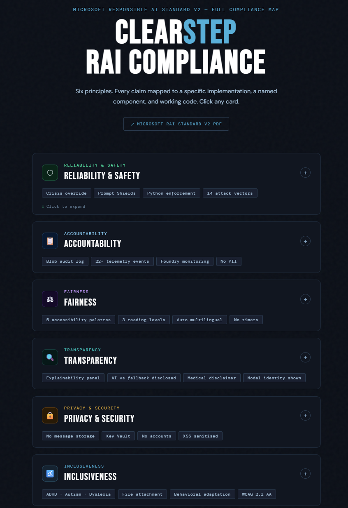
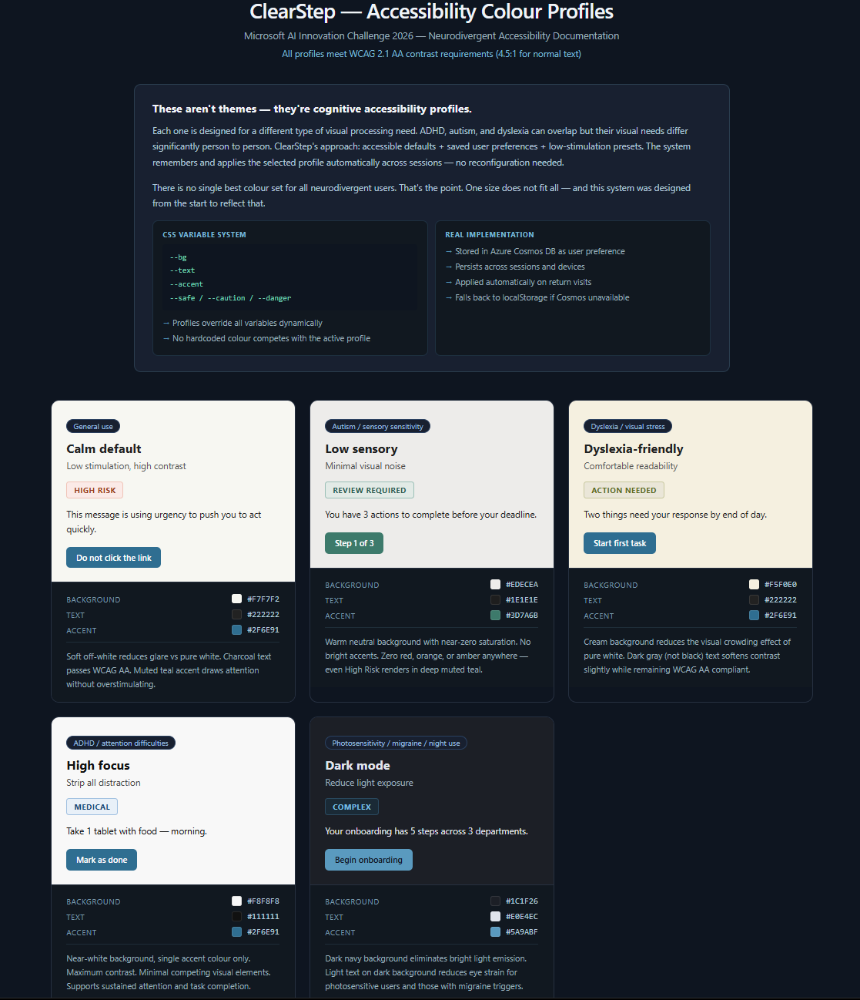

[README.md](https://github.com/user-attachments/files/26270277/README.md)
# ClearStep
### Microsoft AI Innovation Challenge Hackathon — March 2026

> **ClearStep is an AI decision-support system that reduces cognitive overload** while helping users determine if something is safe to act on, and breaking overwhelming information into clear, calm, actionable steps. Built for neurodiverse users who need structure, not more noise.

**🔗 Live Demo:** [`https://clearstep-gqb6gpa9hzbdf5gy.canadaeast-01.azurewebsites.net`](https://clearstep-gqb6gpa9hzbdf5gy.canadaeast-01.azurewebsites.net)
**📁 Repository:** [github.com/joannedada/clearstep](https://github.com/joannedada/clearstep)

---

## Hackathon Challenge

**Cognitive Load Reduction Assistant** — *An adaptive AI system that simplifies complex information for users experiencing cognitive overload.*

Neurodiverse individuals, including people with ADHD, autism, and dyslexia, experience cognitive overload when interacting with dense documents, complex tasks, or unstructured information. The challenge called for an AI-powered assistant that:

- Transforms information into clear, structured, and personalised formats aligned to individual accessibility preferences
- Decomposes complex instructions into step-by-step, time-boxed tasks
- Simplifies and summarises documents at adjustable reading levels
- Provides focus support through reminders and contextual guidance
- Securely stores and applies user accessibility preferences across interactions
- Enforces responsible AI safeguards through calm, supportive, non-anxiety-inducing language
- Explains its simplification choices
- Evolves from a proof of concept into an operational, observable accessibility service

ClearStep addresses every aspect of this brief. It extends the brief with a second mode focused on a closely related need: helping users decide whether something feels safe to act on at all — a trust gap that directly compounds cognitive overload for neurodiverse users.

---

## The Solution — Two Modes, One Goal

ClearStep is a two-mode AI system designed to reduce cognitive overload in moments of uncertainty and overwhelm. Both modes use the same approach: calm, structured guidance without adding pressure.

### Mode 1 — Is This Safe?
Paste any message, email, link, or text that feels suspicious or confusing. ClearStep runs it through a 3-layer AI pipeline and returns:
- A risk level: **Safe**, **Caution**, or **High Risk**
- The specific warning signals detected (urgency pressure, impersonation, suspicious links, money requests, threat language)
- Exactly what to do next; two calm, actionable steps

### Mode 2 — Make It Simple
Paste anything overwhelming like medical instructions, government appeals, confusing work emails, complex onboarding tasks. Or attach a file (.txt, .pdf, .docx). ClearStep breaks it into:
- **Before you start** — safety warnings (things to never do) separated from action steps
- **Key facts** — deadlines, requirements, conditions (labelled, 2–4 words each)
- **One step at a time** — progress bar, completion tracking, undo, optional calendar reminders
- Steps batched in groups of 5 to prevent re-introducing cognitive overload on long documents

---

## How It Meets the Challenge Brief

| Challenge Requirement | ClearStep Implementation |
|---|---|
| Decompose complex instructions into step-by-step tasks | Make It Simple mode that extracts and sequences every action from the source document, one step at a time |
| Time-boxed tasks | Optional calendar reminders, user-initiated, not imposed. Google Calendar + Outlook. No urgency added. |
| Adjustable reading levels | Three levels (Big / Normal / Small) controls font size, line height, and AI output density. The model writes differently at each level. |
| Simplify and summarise documents | Meaning field capped at 8–15 words by reading level. Key items surface deadlines and conditions without surrounding complexity. |
| Focus support through reminders | Step-level reminders with named time options. Smart detection opens date picker for deadline-containing tasks. |
| Securely stored accessibility preferences | Palette and reading level stored in Azure Cosmos DB per anonymous session. Applied automatically on return. |
| Adapts over time | Reading level auto-inferred from usage history via Cosmos DB. On return, the system applies the user's consistent preference automatically — no configuration required. The more a user interacts, the less they have to set up. |
| Responsible AI — calm language | No fear amplification. Signals are patterns, not accusations. High Risk means take care, not danger. |
| Explain simplification choices | "Why this result?" explainability panel on every output. |
| Operational, observable service | 22+ custom Application Insights telemetry events. Safety features proven firing in production. |

---

## 3-Layer AI Pipeline

Every request passes through three layers in strict sequence. A failure at any layer is handled gracefully and the app never crashes.

```
User Input (text or uploaded file)
    │
    ├─ [Upload only] /api/upload pre-screening
    │         screen_upload_content() runs before text reaches the pipeline:
    │         • Azure Content Safety: SelfHarm ≥ 4 → crisis block
    │         •                       Sexual / Violence / Hate ≥ 2 → content block
    │         • Prompt Shields: injection attempt → block
    │         • Cyber keyword regex: exploitation content → block
    │         Extracted text from .txt, .pdf, or .docx
    │         placed into textarea — user submits normally from there
    │
    ▼
[Layer 1] Azure AI Content Safety
          Screens for SelfHarm severity ≥ 4
          IF triggered → hardcoded 988 response returned immediately
          Claude is NEVER called
    │
    ▼
[Layer 1b] Azure AI Content Safety — Prompt Shields
          Detects jailbreak and prompt injection attempts
          IF triggered → hardcoded High Risk response returned immediately
          Claude is NEVER called
    │
    ▼
[Layer 2a] Azure AI Language
          Detects input language (ISO 639-1)
          Non-English → lang_instruction injected into Layer 3 prompt
    │
    ▼ (Is This Safe? mode only)
[Layer 2b] Azure OpenAI via Microsoft Foundry
          Extracts 5 boolean signal flags:
          urgency / money_request / impersonation / suspicious_link / threat_language
          Flags passed as context to Layer 3
    │
    ▼
[Layer 3] Anthropic Claude (claude-sonnet-4-20250514)
          Final risk assessment + step generation
          Mode-specific prompts, reading level rules, language instruction
          User message XML-delimited — prompt injection surface eliminated
    │
    ▼
[Validation] validate_response() — Python, server-side
          Schema check, medical hardening, frequency expansion, leaked warning detection
          risk_level enforced against warnings (Safe invalid when real warnings exist)
          is_medical keyword backstop catches model misclassification
          Per-item word limits enforced
          Malformed output rejected before user sees anything
    │
    ▼
[Storage] Azure Blob Storage
          AI response JSON logged — no raw message content
    │
    ▼
[Telemetry] Azure Application Insights
          22+ custom events fired per request
```

Full architecture and request flow diagrams: [`docs/ARCHITECTURE.md`](./docs/ARCHITECTURE.md)

---

## Architecture Overview



**[→ Open interactive pipeline explorer](https://htmlpreview.github.io/?https://github.com/joannedada/clearstep/blob/main/docs/clearstep_pipeline.html)** — click any layer to see exactly how it works, what it enforces, and why it was built that way.

---

## Azure Services — 10 Services + Microsoft Foundry

ClearStep uses 10 Azure services and Microsoft Foundry. Each was chosen for a specific reason, not to pad a list.

| Service | Purpose |
|---|---|
| **Azure App Service** | Hosts the Flask application - managed hosting with GitHub Actions CI/CD |
| **Azure AI Content Safety** | Crisis screening (SelfHarm ≥ 4 → 988 response) + Prompt Shields jailbreak detection. Runs before any LLM. Also screens all uploaded file content. |
| **Azure OpenAI via Microsoft Foundry** | Signal extraction - 5 boolean flags injected into Claude's prompt as pre-processed context |
| **Azure AI Language** | Language detection - non-English inputs trigger full multilingual Claude response across all fields |
| **Azure AI Speech** | Text-to-speech - converts result sections to MP3 audio on demand. 10 languages. Audio never stored. |
| **Azure Key Vault** | Secrets management - no keys in code or config files. Managed Identity auth. |
| **Azure Blob Storage** | Audit log - AI response JSON stored per analysis. No raw message content. |
| **Azure Application Insights** | Telemetry - 22+ custom events prove safety features are firing in production |
| **Azure Cosmos DB** | Persistent accessibility preferences - palette and reading level stored anonymously per session |
| **Microsoft Foundry** | Deployment platform for signal-classifier (gpt-4o-mini). Controlled capacity, version management, monitoring. |

Full breakdown including why each was chosen, how it's wired, and where in the code: [`docs/AZURE_SERVICES.md`](./docs/AZURE_SERVICES.md)

---

## Responsible AI — Microsoft RAI Standard v2

| Principle | What ClearStep built |
|---|---|
| **Accountability** | Every analysis logged to Blob Storage. 22+ App Insights events track system behaviour in production including upload blocks, TTS generation, and safety enforcement events. |
| **Reliability & Safety** | Crisis response hardcoded — cannot be altered by model behaviour. Prompt Shields detect jailbreak at infrastructure level. Upload content screening runs a full safety pipeline before any text reaches the LLM. Medical hardening enforced in Python. Schema validation rejects malformed output. Rate limiting prevents abuse. XSS sanitisation protects against model output injection. |
| **Fairness** | 5 accessibility palettes designed for specific neurological needs. Reading level changes AI output density. Language detection serves non-English speakers automatically. File attachment supports users who cannot copy/paste. |
| **Transparency** | "Why this result?" panel on every output. AI tool disclaimer always visible. Medical content always defers to original document. Fallback mode shows visible indicator when AI is unavailable. |
| **Privacy** | No message content stored. No file content stored as files are read in memory and discarded. Cosmos DB stores anonymous session ID + two preference values only. No accounts, no tracking. |
| **Human Oversight** | Medical and legal content always defers to real professionals. Crisis response sends users to human services (988). App never presents itself as a replacement. Step engine never auto-advances, the user controls every transition. |
| **Inclusiveness** | Built for ADHD, dyslexia, autism, low digital literacy, elderly users, and non-English speakers. File attachment reduces friction. TTS supports low-literacy and vision-impaired users. Fully responsive. |

Full mapping with implementation detail: [`docs/RESPONSIBLE_AI.md`](./docs/RESPONSIBLE_AI.md)



**[→ Open interactive RAI compliance map](https://htmlpreview.github.io/?https://github.com/joannedada/clearstep/blob/main/docs/clearstep_rai.html)** — six RAI principles, each mapped to a specific implementation, named component, and working code snippet.

---

## Accessibility Design

These aren't themes — they're cognitive accessibility profiles. Each one is designed for a different type of visual processing need, and the system remembers and applies it automatically.



**[→ View interactive palette showcase](https://htmlpreview.github.io/?https://github.com/joannedada/clearstep/blob/main/docs/clearstep_palettes.html)** — see each profile rendered with real colours, hex values, and design rationale.

Five colour palettes each override the full CSS semantic variable set — not just background and text, but every state colour including safe, caution, danger, warning, medical bar, and completion states.

| Profile | Who it's for | Key decision |
|---|---|---|
| **Calm default** | General users | Off-white (#F7F7F2) reduces screen glare. Muted teal accent is non-aggressive. |
| **Low sensory** | Autism / sensory sensitivity | Zero red, orange, or amber. Even High Risk renders in deep muted teal. |
| **Dyslexia-friendly** | Dyslexia | Cream background (#F5F0E0) reduces visual vibration. No competing colour families. |
| **High focus** | ADHD | Single accent colour. Completion state visually distinct from safe-state green. |
| **Dark mode** | Photosensitivity / night use | Dark navy (#1C1F26), not pure black. Muted variants across all states. |

Three reading levels (Big / Normal / Small) control font size, line height, and AI output density — the model writes differently at each level. Preferences persist across sessions via Cosmos DB.

Full design rationale: [`docs/DESIGN_DECISIONS.md`](./docs/DESIGN_DECISIONS.md)

---

## Security

ClearStep was tested across 14+ attack vectors including prompt injection, schema manipulation, file upload abuse, and safety bypass attempts. Security does not rely on prompt rules alone — behavior is enforced in code through validation, pre-screening, and layered defences that operate independently of model output.

- **CORS locked** to production domain — no third-party API access
- **Rate limiting** on all AI-calling endpoints: 10/min analyze, 5/min upload and TTS, 20/min calendar
- **Prompt injection** mitigated via Azure Prompt Shields (infrastructure) + XML message delimiters (prompt) + schema validation (output)
- **14 attack vectors tested** — all return High Risk or Caution, never compliance
- **XSS sanitisation** — all model output rendered via `innerHTML` escaped through `esc()` before DOM insertion
- **File upload defence-in-depth** — extension + MIME + size + filename sanitisation + 3-layer content screening
- **Zero secrets in code** — Azure Key Vault with Managed Identity, env var fallback

Full security documentation including all 14 attack vector test results: [`docs/SECURITY.md`](./docs/SECURITY.md)

---

## Tech Stack

| Layer | Technology | Why |
|---|---|---|
| Frontend | Vanilla HTML/CSS/JS — single file, no build step | Zero dependency surface, instant load, works on any device |
| Backend | Python Flask + Gunicorn | Lightweight, fast, native Azure deployment |
| Primary AI | Anthropic Claude `claude-sonnet-4-20250514` | Best-in-class reasoning for medical and safety content |
| Signal extraction | Azure OpenAI (gpt-4o-mini) via Microsoft Foundry | Fast, cheap, zero-temperature classification |
| Crisis screening | Azure AI Content Safety | Hardened, purpose-built and not a prompt |
| Language detection | Azure AI Language | Automatic multilingual support without UI complexity |
| Text-to-speech | Azure AI Speech | On-demand MP3, 10 languages, audio never stored |
| PDF extraction | pypdf | Pure Python, no system dependencies |
| Word extraction | python-docx | Pure Python .docx extraction |
| Secrets | Azure Key Vault + DefaultAzureCredential | Zero secrets in code or config files |
| Preferences | Azure Cosmos DB | Low-latency anonymous preference storage with graceful fallback |
| Audit log | Azure Blob Storage | Immutable result log, no PII |
| Observability | Azure Application Insights | 22+ custom events, production safety monitoring |
| Deployment | Azure App Service + GitHub Actions CI/CD | Managed hosting, automatic deployments on push to main |
| Rate limiting | Flask-Limiter | Per-IP request caps on all write endpoints |
| CORS | Flask-CORS | API locked to ClearStep domain |

---

## Running Locally

```bash
git clone https://github.com/joannedada/clearstep
cd clearstep
pip install -r requirements.txt
```

Create a `.env` file — **never commit this:**
```
ANTHROPIC_API_KEY=your_key_here
```

```bash
python app.py
# Open http://localhost:5000
```

All Azure services degrade gracefully if not configured. Content Safety, Language detection, OpenAI extraction, Speech, Cosmos, and Blob all skip or return clean errors silently. The core experience works with only an Anthropic API key.

---

## Project Structure

```
clearstep/
├── app.py                  # Flask backend — pipeline, Azure integrations, validation
├── index.html              # Complete frontend — modes, palettes, task engine, reminders
├── requirements.txt        # Python dependencies
├── .github/
│   └── workflows/          # Azure App Service CI/CD pipeline
└── docs/
    ├── ARCHITECTURE.md     # Full system design and request flow
    ├── RESPONSIBLE_AI.md   # Microsoft RAI Standard v2 mapping
    ├── SECURITY.md         # Application security hardening and test results
    ├── AZURE_SERVICES.md   # Every Azure integration explained
    ├── DESIGN_DECISIONS.md # Why we built it the way we did
    ├── CONTRIBUTING.md     # Local setup, architecture orientation, dev notes
    ├── QA.md               # Design decisions, tradeoffs, judging criteria Q&A
    ├── CONTRIBUTIONS.md    # Team contributions and ownership
    ├── clearstep_pipeline.html  # Interactive AI pipeline explorer
    ├── clearstep_palettes.html  # Interactive accessibility colour profiles
    └── clearstep_rai.html       # Interactive RAI compliance map — 6 principles, code evidence
    ├── pipeline_preview.png     # Pipeline diagram screenshot (README)
    ├── palette_preview.png      # Colour profiles screenshot (README)
    └── rai_preview.png          # RAI compliance map screenshot (README)
```

---

## Hackathon Scope & Intentional Tradeoffs

This project is designed as a focused MVP for the Microsoft AI Innovation Challenge. Core functionality, safety handling, and user experience flows are fully implemented and tested.

Some infrastructure-level features are intentionally scoped for post-hackathon hardening:

- Rate limiting currently uses in-memory storage and resets on worker restart
- `/api/preferences` endpoint is not authenticated
- Content Safety currently evaluates the first 1,000 characters of uploaded file content
- Self-harm detection uses a high-confidence threshold (severity ≥ 4)

These decisions were made to prioritise reliable real-time interaction, clear user-facing safety behaviour, and consistent demo performance. All deferred items are documented and can be upgraded without changes to the core system design.

---

## Roadmap

- **Session history:** Optional anonymous history so users can revisit past analyses
- **Browser extension:** "Is This Safe?" directly from email clients
- **Image Upload/OCR:** Image upload and OCR integration are implemented in the backend.
	•	In the current deployment environment, Azure Vision OCR is limited by the selected resource tier.
	•	For demo stability, ClearStep is presented primarily as a text-first experience.
	•	Upgrading the OCR resource tier would enable full screenshot-to-text extraction.
---

## Team

| Name | Role |
|---|---|


---

**Hackathon Challenge:** Cognitive Load Reduction Assistant
**Deployed:** Azure App Service, Canada East
**Repo:** [github.com/joannedada/clearstep](https://github.com/joannedada/clearstep)
**Entry Period:** March 16–27, 2026
